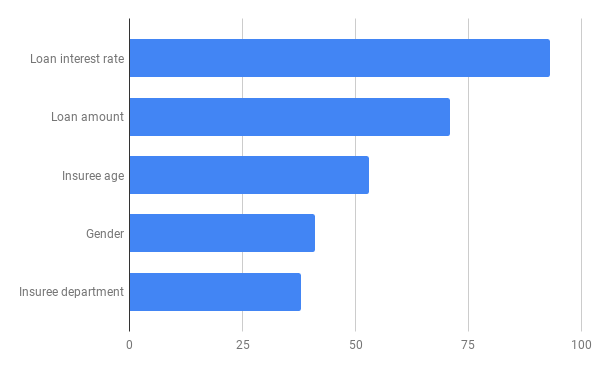

# 1. General Information
## 1.01 Standard version
0.1
## 1.10 Name
Home insurance claims classifier.
## 1.20 Purpose
Monitoring the behaviour of classifier (version 2) over monitored period
## 1.30 Monitored period
From 2021-09-01 to 2021-09-30 

# 2. Statistics 
## 2.20 Number of predictions
5149 predictions monitored
## 2.50 Average duration of predictions
0.04ms average prediction duration
## 2.60 Environmental impact
Total emissions are estimated to be 3.05e-04 kgCO2eq.
It represents 0.01 tree-days.

# 5. Production Data Audit
## 5.10 Descriptive statistics
### 5.10.1 Age

### 5.10.2 Gender

## 5.20 Average number of warnings per prediction
Around 0.3 warnings raised per prediction
## 5.30 Features with unobserved train values

TO UPDATE

# 7. Model Audit
## 7.10 Features importance

## 7.30 Stability over time

## 7.40 Predictions distribution

## 7.41 Average score per prediction
0.34 in production, compared to 0.46 during testing
## 7.50 Drift observation
No significative drift observed