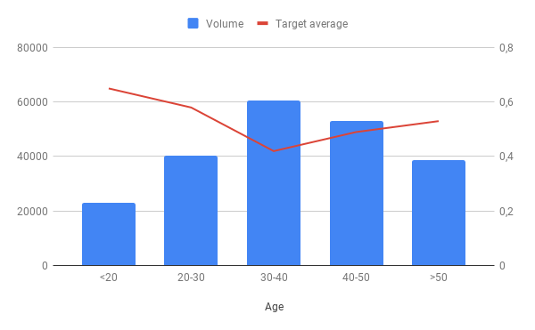
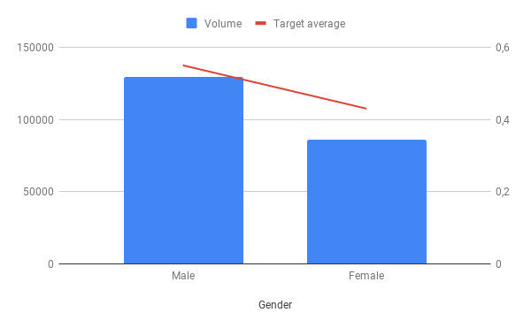
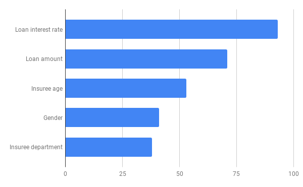
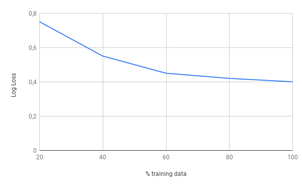
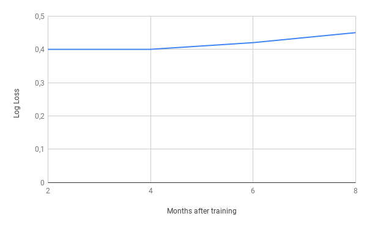

# 1. General Information
## 1.01 Standard Version
0.1
## 1.10 Name
Home insurance claims classifier.
## 1.20 Purpose
For a better client experience and an improved claim processing time, predict at First Notification of Loss if a claim will be complex to handle, or simple. 
## 1.30 Date
12.01.2019

## 1.40 Contributors
John Doe. 

## 1.50 Source code
The source code is available at this address: http://www.intranet/project/dir

# 2. Initial Data 
## 2.10 Sample
| Claim Id   | Age | Gender | Loan Amount  | ...|
| ------------- |-------------|-------------|-------------|-------------|
| 2938           | 38 |M|74000
| 2939      | 42      |   F |123000
| 2940      | 53      |   F |85000
## 2.20 Size
Columns: 19
Rows: 215 412
## 2.30 Variables description

| Column name   | Description | Example |
| ------------- |-------------|-------------|
| Age           | The age of the client |34
| Gender      | The gender of the client      |   M |

## 2.40 Dataset unique signature
At this step, the dataset unique signature is:
```
abece2ef84645c61499cb4b74f552daa205380666b1ab03bbfa2fcdab91b11b6
```

# 3. Data Preparation 
## 3.10 Rows filtering
No row has been removed.

## 3.20 Columns filtering
The 'Claim Id' variable has been removed.

## 3.30 Missing values handling
For categorical variables: replacement by the most frequent value.
For numerical variables: replacement by variable median. 

## 3.40 Dataset unique signature
At this step, the dataset unique signature is:
```
87b01d1b7bc1b930348dd2d6d7c6d8c00fd5fa5179badc3a8d0a5eb8ab878eae
```

# 4. Features engineering

## 4.10 Created variables
2 variables have been created: 
- Age of the insured person at loan subscription, in months (loan subscription date - insured birth date)
- Loan seniority at claim creation date, in months (claim creation date - loan subscription date)

## 4.20 Target creation
The target is computed like this: if claim processing time (settlement date - creation date) is superior to 3 weeks, it is considered as complex (target = 1), else it is simple (target = 0).

## 4.30 Dataset unique signature
At this step, the dataset unique signature is:
```
bdb4e3721bd9ea1db352b8672a2facb61058380869f09bd35bb0072695d86a4d
```
# 5. Training Data Audit

## 5.10 Variables statistics
### 5.10.1 Age


### 5.10.2 Gender


# 6. Model Description

## 6.10 Used algorithm
We used the GradientBoosting algorithm (scikit-learn 0.20.2) with the following parameters: 

```python
{'nthread': 4, 'objective': 'binary:logistic', 'eval_metric': 'logloss', 'colsample_bytree': 1, 'silent': 1, 'subsample': 0.8, 'learning_rate': 0.2, 'max_depth': 8, 'min_child_weight': 8, 'lambda': 1, 'alpha': 1}
```

## 6.20 Metrics
We used the Log Loss metric. 

## 6.30 Validation strategy
We chosed hyperparameters and variable with a 3-fold cross-validation. 

## 6.40 Performance
The cross-validation score with the logloss metric is : 0,406

## 6.50 Model unique signature
Trained model unique signature is:
```
a5b4e3721bd9ea1db352b8672a2facb61058380869f09bd35bb0072695d88cbb
```


# 7. Model Audit
## 7.10 Variable importance


## 7.20 Learning curve


## 7.30 Stability over time

